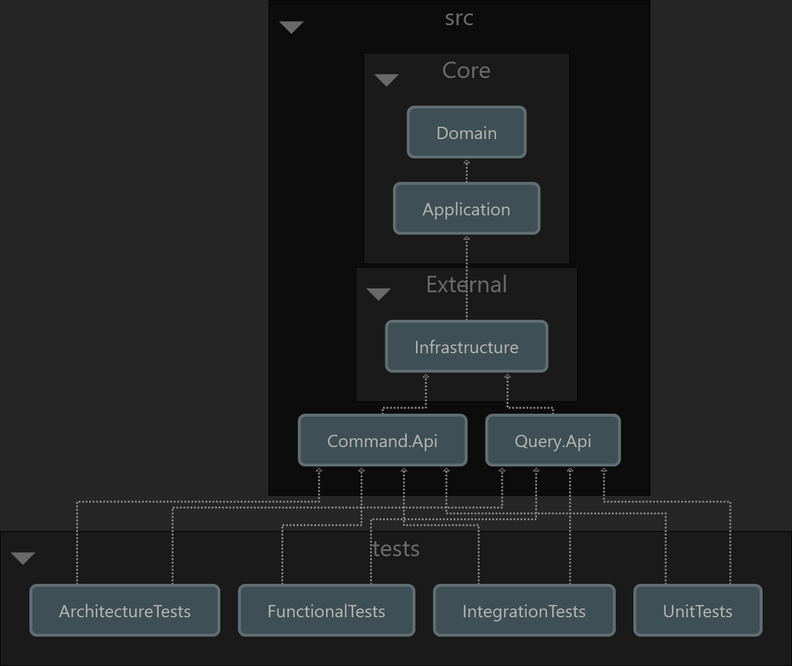

Microsoft.Asp.Net.Core.Starter
==============================

A starter repository for Microsoft ASP.NET Core developments with:

- [Clean Architecture](https://deviq.com/architecture/clean-architecture)
- [Domain Driven Design (DDD)](https://deviq.com/domain-driven-design/ddd-overview)
- [Test-Driven Development (TDD)](https://deviq.com/testing/testing-overview)

Clean Architecture
------------------

> From [Uncle Bob's blog](https://blog.cleancoder.com/uncle-bob/2012/08/13/the-clean-architecture.html).

Project Dependency Diagram
--------------------------

